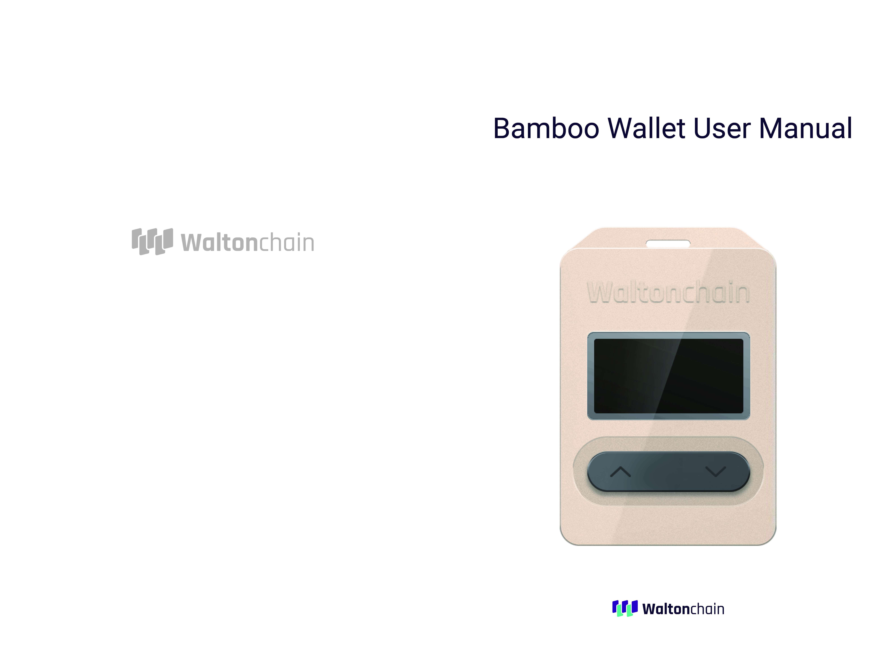

# BAMBOO_WALLET

Bamboo Wallet is a hardware wallet used to store blockchain token account data. It connects to the host via USB, obtains account information and supports token transactions. Account data locates in the secured storage and will not be lost if the wallet gets disconnected from the power supply. It supports transactions with various tokens through the app. For more features, please refer to the Functions section.

****

****

****

# BAMBOO_WALLET Update software to v1.2

1.Run  BambooWallet_v1.2.exe

# BAMBOO_WALLET Update firmware

1. Connect the wallet to the host via USB while holding the "<" (left) and ">" (right) buttons. The wallet will enter the update interface.

2. Run update/WTCWalletBootLoader.exe

3. Press OpenFile, select the *.bin file to perform the upgrade.

4. Press BootLoad. The progress bar will appear. You can use the wallet when the upgrade is complete.
